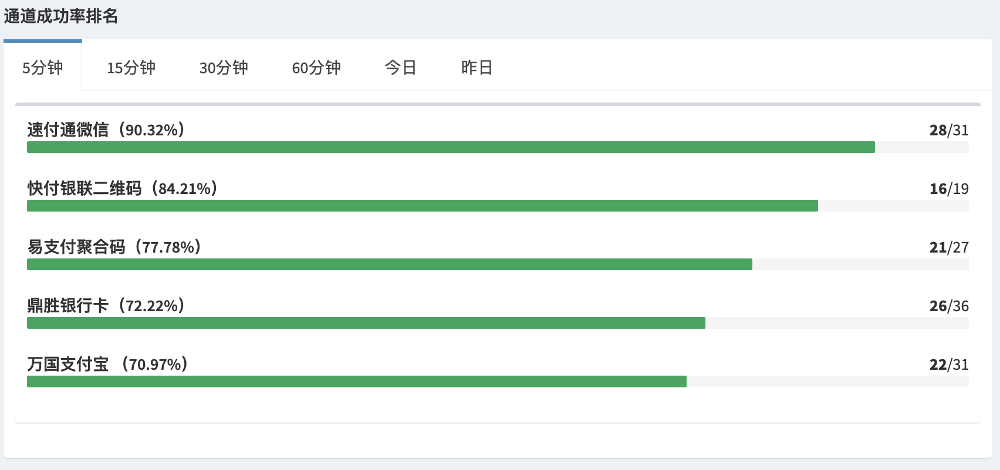
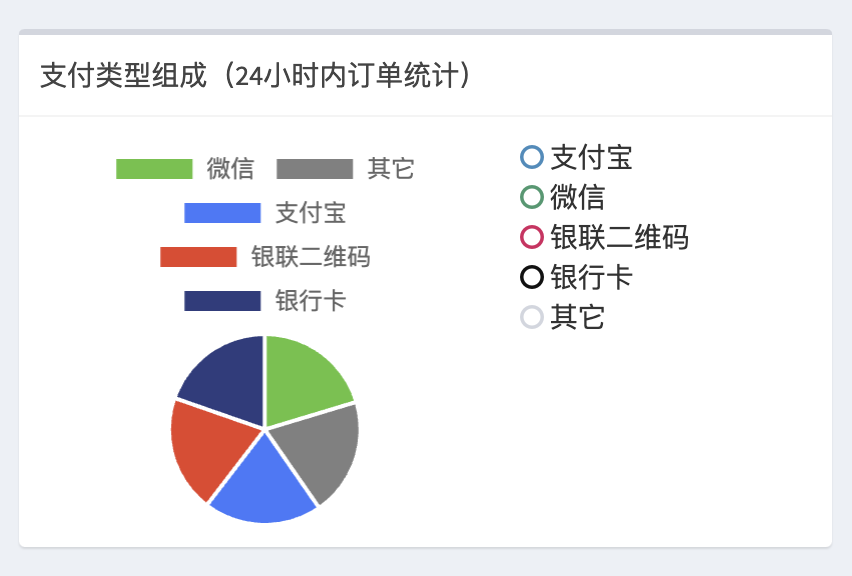
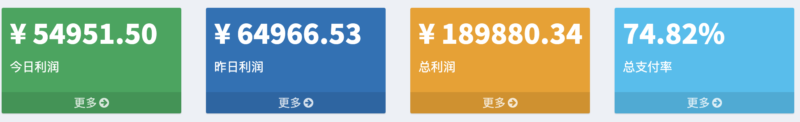
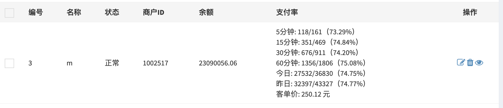
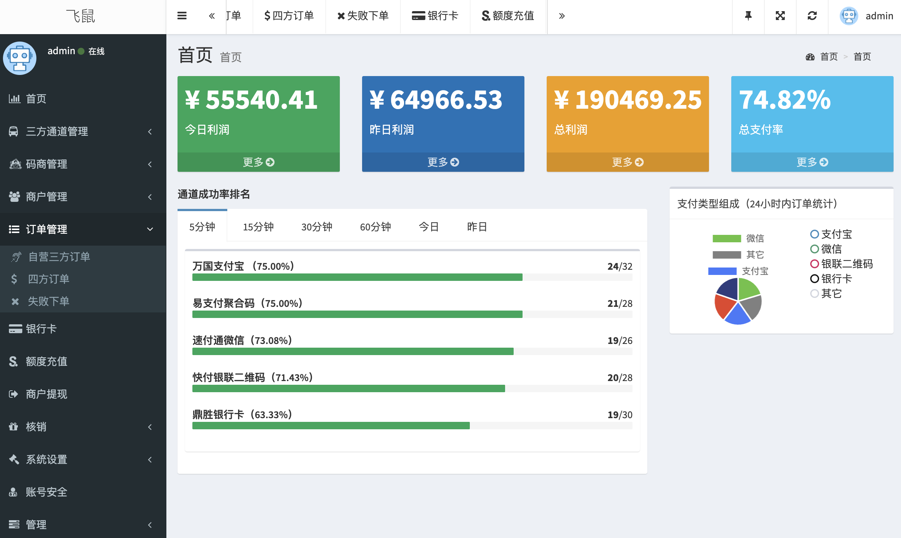

  

# 飞鼠四方支付系统

使用go(golang)语言编写的四方支付系统

### 特点

* 编译成**二进制文件**，彻底避免**源码泄漏**。
* 支持**缓存**、**消息队列**、**异步任务**、**定时任务**。
* **实时数据分析**
* 并发高。4核8G服务器（RMB200元左右），日处理订单**一百万+**

### 功能

* 通道成功率实时监控

* 支付类型分析

* 实时数据统计

总站:

商户：

* 包含：总后台、管理后台、商户后台、核销商后台

* 支持支付通道按权重分配流量

* 数据根据设置定时清理

* 支持设置自营三方通道

* 支持码商角色

* IP白名单

* 配套核销系统，方便各种卡密核销

项目截图：

###  演示地址

https://feishu999.com/admin

##### 管理员登录：
> 账号：op 密码：加群获取

##### 商户登录：
> 账号：m 密码：加群获取

## 联系
Telegram(电报) ：[技术交流群](https://t.me/feishu_group)
